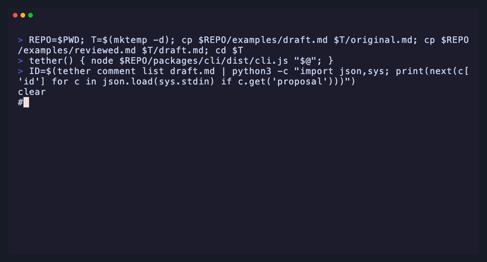

# Examples

Two files, one document:

- [`draft.md`](draft.md) — a clean essay, exactly as an author wrote it.
- [`reviewed.md`](reviewed.md) — the **same essay mid-review**: two human comments, one agent proposal pending, one agent flag-back. Open it raw to see the wire format (invisible `<!--tether:c=…-->` markers + the store block at EOF); render it anywhere and the comments disappear.

The two files prove the core guarantee:

```sh
tether export reviewed.md | diff - draft.md   # no output — byte-identical
```

The same loop, live at the command line:



## Walk the loop yourself

```sh
npm i -g tether-md        # or: npx tether-md, or node packages/cli/dist/cli.js from a clone
cp reviewed.md play.md
```

**1. See the state of the review:**

```sh
tether status play.md            # 3 comments, 1 proposal pending
tether comment list play.md      # full JSON: bodies, anchors, the proposal
```

**2. Preview the pending suggestion (what Accept would change):**

```sh
tether comment diff play.md <id-from-list>
```

**3. Decide, as the human:**

```sh
tether comment accept play.md <id> --write    # applies the rewrite, clears the comment
# or
tether comment reject play.md <id> --write    # discards it, prose untouched
```

**4. Play the agent** (or let a real one do it — see [`skills/tether-edit/SKILL.md`](https://github.com/tether-md/tether-md/blob/main/skills/tether-edit/SKILL.md)): pick an open human comment and propose a rewrite of its anchored phrase:

```sh
tether comment suggest play.md <id> --to "your rewrite of the quoted phrase" --write
```

**5. Prove nothing leaked, whenever you like:**

```sh
tether export play.md            # prints the clean essay
tether status play.md --check    # exit 4 if any anchor needs attention (CI-friendly)
```

**6. Try to break the anchors** — edit `play.md`'s prose in any editor (the markers are just text; leave them and the EOF store alone), then re-run `tether status`. Comments either follow the text they were about, get flagged `needs-review` (fuzzy re-anchor), or orphan loudly.

## With an agent for real

Point any MCP-capable agent at the server and ask it to "address my comments":

```sh
claude mcp add tether -- tether mcp
```

The agent can list, propose, and flag back. The accept, reject, and edit tools are simply not registered on the MCP server.
